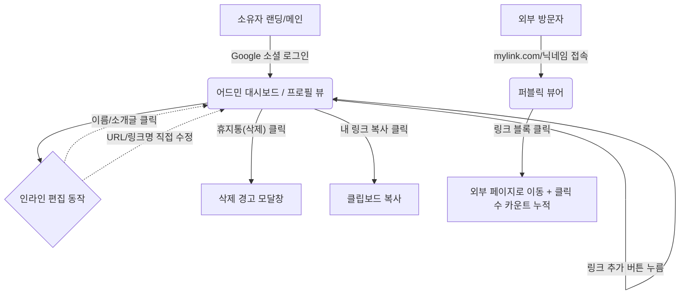

# 마이링크(My Link) - 와이어프레임(Wireframe) & 화면 흐름도

## 1. 화면 탐색 흐름 (User Flow & IA)

방문자와 소유자의 화면 간 이동 경로를 나타낸 구조입니다.



---

## 2. 화면 와이어프레임 (ASCII Art Style)

'인라인 편집' 기능을 채택했기 때문에, 어드민 화면과 방문자 화면의 전체적인 레이아웃이 동일한 **WYSIWYG (보이는 그대로가 결과물)** 형태를 기반으로 설계했습니다. 

### 2.1 퍼블릭 뷰어 (방문자 화면 / Mobile 대응 기준)
깔끔하고 직관적인 모바일 친화적 인터페이스입니다. (`shadcn/ui` 적용)

```text
+-----------------------------------------+
|                                         |
|                                         |
|         [ 유저 네임 (실제 이름) ]           |
|                                         |
|       "소개글이 들어가는 텍스트 영역입니다"     |
|                                         |
|                                         |
|  +-----------------------------------+  |
|  |                                   |  |
|  |  (파비콘)  내 포트폴리오 사이트 보기    |  |
|  |                                   |  |
|  +-----------------------------------+  |
|                                         |
|  +-----------------------------------+  |
|  |                                   |  |
|  |  (파비콘)  유튜브 채널 구경하기        |  |
|  |                                   |  |
|  +-----------------------------------+  |
|                                         |
|  +-----------------------------------+  |
|  |                                   |  |
|  |  (파비콘)  인스타그램 놀러오기         |  |
|  |                                   |  |
|  +-----------------------------------+  |
|                                         |
|                                         |
|            Powered by My Link           |
+-----------------------------------------+
```

---

### 2.2 어드민 관리 뷰 (소유자 화면 / 인라인 편집 모드)
방문자 뷰와 매우 흡사하지만, 각 요소를 마우스로 클릭하면 텍스트 커서가 생기며 즉석에서 내용(Text, URL) 수정이 가능합니다.

```text
+-----------------------------------------+
|   [로그아웃]                [내 링크 공유]  |
|                                         |
|   [ ✏️ 유저 네임 (클릭하여 수정) ]          |
|                                         |
|   [ ✏️ 소개글 (클릭하여 텍스트 수정) ]       |
|                                         |
|                                         |
|  +-----------------------------------+  |
|  | (파비콘)                            |  |
|  |  [✏️ 링크 제목]                [🗑️] |  |
|  |  URL: [✏️ https://github.com/... ] |  |
|  +-----------------------------------+  |
|                                         |
|  +-----------------------------------+  |
|  | (파비콘)                            |  |
|  |  [✏️ 링크 제목]                [🗑️] |  |
|  |  URL: [✏️ https://youtube.com...]  |  |
|  +-----------------------------------+  |
|                                         |
|  +-----------------------------------+  |
|  |                                   |  |
|  |      [ ➕  새로운 링크 추가하기 ]      |  |
|  |                                   |  |
|  +-----------------------------------+  |
|                                         |
+-----------------------------------------+
```

---

## 3. UI/UX 디자인 규칙
1. **타이포그래피 및 여백**: shadcn/ui의 기본 컴포넌트 여백(`gap`, `padding`)을 적극 활용하여 모던한 스타일 구현.
2. **다크/라이트 모드 자동화**: 브라우저의 기본 설정(OS 설정)을 따라가게 하거나, 헤더 상단에 간이 토글 버튼 배치 가능여부 검토.
3. **편집 상태 식별**: 관리자 화면에서 인라인 편집 대상인 텍스트 위로 마우스를 올릴 때 미세한 배경색 변화나 `✏️(pencil)` 아이콘을 띄워 편집 가능함을 시각적으로 안내.
